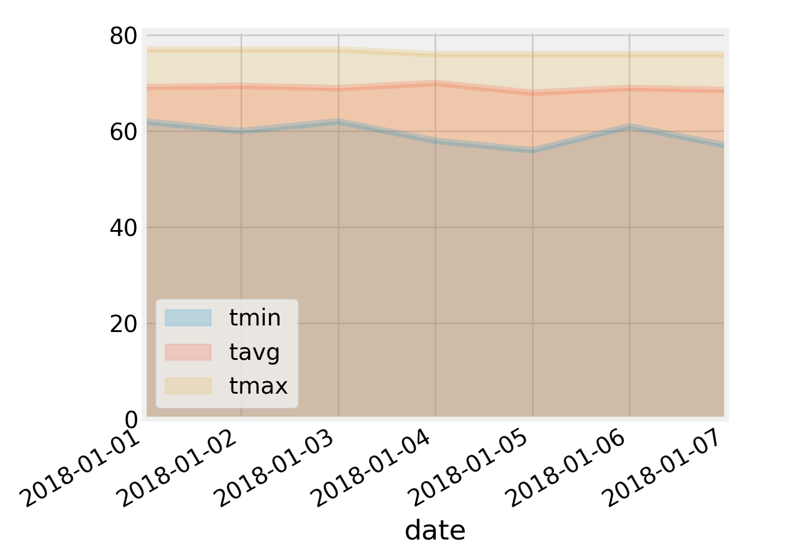

<!--lint disable no-heading-punctuation-->
# Surfs Up!
Exploratory data analysis and API creation of Hawaii climate data.
Planning for a long vacation to Hawaii, we would like to check out the area using our analytical skills to understand the climatic conditions. Once we get what we want, we are sharing it to the world with a easy to use simple API.

Using python, Pandas ,FLASK

<!--lint enable no-heading-punctuation-->

Congratulations! You've decided to treat yourself to a long holiday vacation in Honolulu, Hawaii! To help with your trip planning, you decided to do some climate analysis on the area. Because you are such an awesome person, you have decided to share your ninja analytical skills with the community by providing a climate analysis api. The following outlines what you need to do.

#data_engineering.ipynb

The climate data for Hawaii is provided through two CSV files.
Using Python and Pandas to inspect the content of these files and clean the data.
Using ORM create tables in database 

## Climate Analysis and Exploration
##climate_analysis.ipynb
Ready to use Python and SQLAlchemy to do basic climate analysis and data exploration on your new weather station tables. 

### Precipitation Analysis

* Use Pandas to print the summary statistics for the precipitation data.

### Station Analysis

* Design a query to calculate the total number of stations.
* Design a query to find the most active stations.
  * List the stations and observation counts in descending order
  * Which station has the highest number of observations?
* Design a query to retrieve the last 12 months of temperature observation data (tobs).
  * Filter by the station with the highest number of observations.
  * Plot the results as a histogram with `bins=12`.

### Temperature Analysis

* Use the `calc_temps` function to calculate the min, avg, and max temperatures for your trip using the matching dates from the previous year (i.e. use "2017-01-01" if your trip start date was "2018-01-01")

* Plot the min, avg, and max temperature from your previous query as a bar chart.

### Rainfall Analysis

* The following are optional challenge queries. These are highly recommended to attempt, but not required for the homework.

  * Calcualte the rainfall per weather station using the previous year's matching dates.

* Calculate the daily normals. Normals are the averages for min, avg, and max temperatures.

  * Create a function called `daily_normals` that will calculate the daily normals for a specific date. This date string will be in the format `%m-%d`. Be sure to use all historic tobs that match that date string.

  * Create a list of dates for your trip in the format `%m-%d`. Use the `daily_normals` function to calculate the normals for each date string and append the results to a list.

  * Load the list of daily normals into a Pandas DataFrame and set the index equal to the date.

  * Use Pandas to plot an area plot (`stacked=False`) for the daily normals.

  

---

## Ready for the Climate App !!!

* Use FLASK to create your routes.

### Routes

* `/api/v1.0/precipitation`

  * Query for the dates and temperature observations from the last year.

  * Convert the query results to a Dictionary using `date` as the key and `tobs` as the value.

  * Return the json representation of your dictionary.

* `/api/v1.0/stations`

  * Return a json list of stations from the dataset.

* `/api/v1.0/tobs`

  * Return a json list of Temperature Observations (tobs) for the previous year

* `/api/v1.0/<start>` and `/api/v1.0/<start>/<end>`

  * Return a json list of the minimum temperature, the average temperature, and the max temperature for a given start or start-end range.

  * When given the start only, calculate `TMIN`, `TAVG`, and `TMAX` for all dates greater than and equal to the start date.

  * When given the start and the end date, calculate the `TMIN`, `TAVG`, and `TMAX` for dates between the start and end date inclusive.

